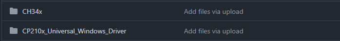
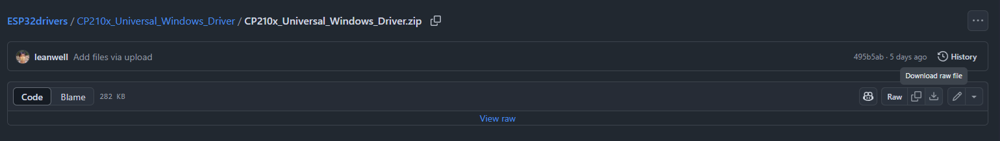
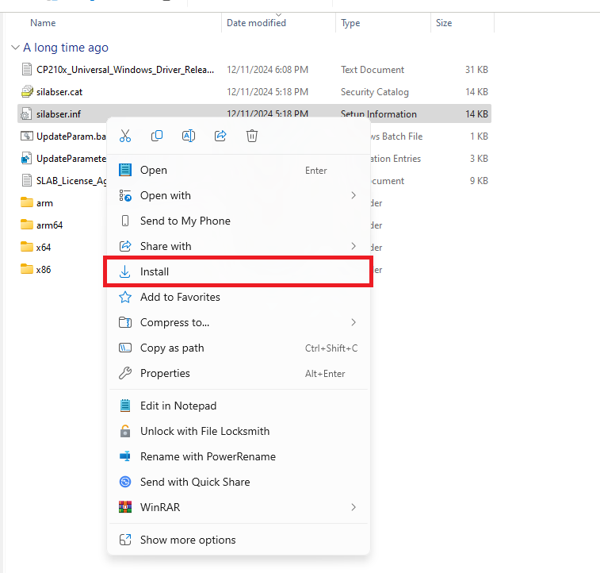
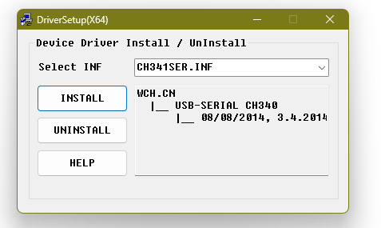
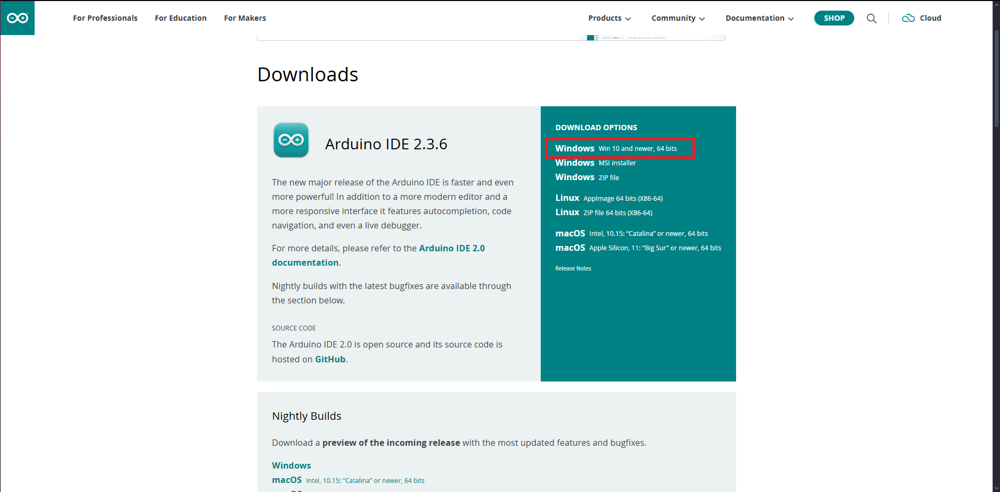
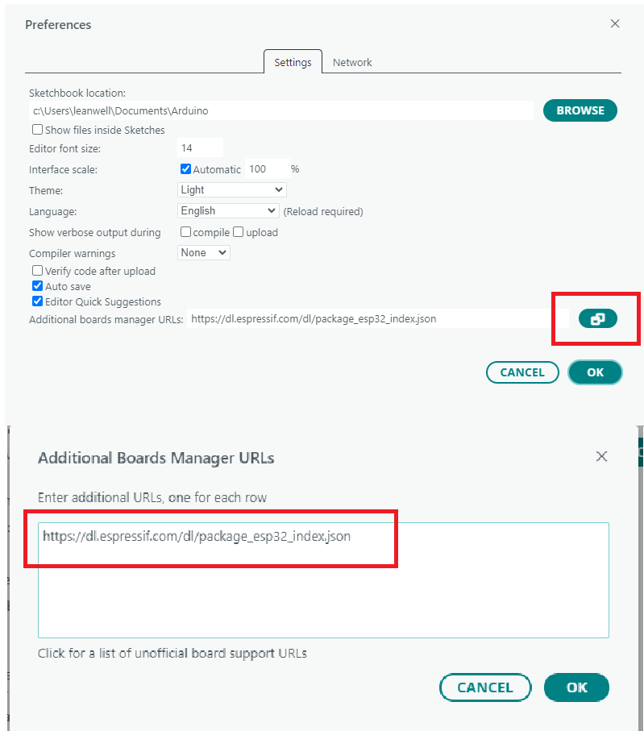
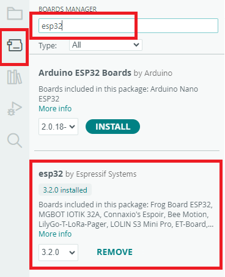
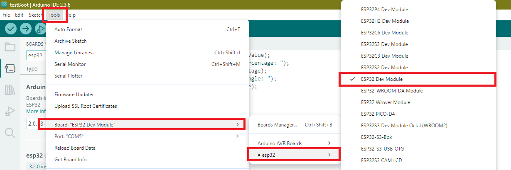
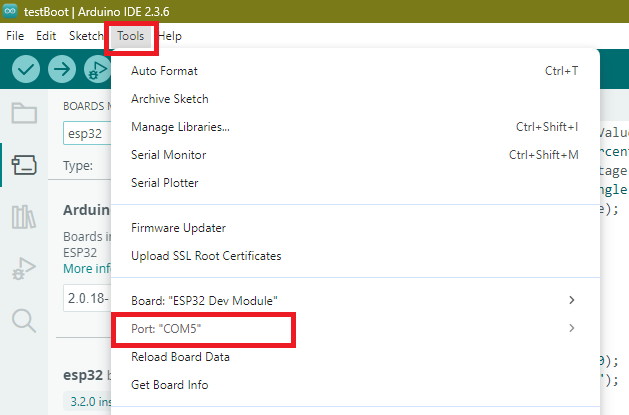

# ESP32drivers

A collection of drivers and libraries for ESP32 boards.

---

## Installation Instructions

## MAKE SURE THE DEVICE IS CONNECTED BEFORE INSTALLING
---

### CP210x Driver

1. Download the ZIP file (Click the download icon labeled as "download raw file").  
     
   

2. Extract it to your preferred folder.

3. Locate `silabser.inf`.  
   

4. Right-click and select **Install**.

---

### CH34x Driver

1. Download the `CH341SER.EXE` file.

2. Open the file.  
   

3. Click **Install**.

---

## Arduino IDE Installation

1. Download the Arduino IDE from:  
   [https://www.arduino.cc/en/software/](https://www.arduino.cc/en/software/)

2. Choose **Windows 10 and newer**.  
   

> ⚠️ Do not download anything under *Nightly Builds*. These versions are unstable and may contain bugs.

---

## Boards Manager Setup

1. Open the Arduino IDE.

2. Go to **File** > **Preferences** > **Additional Board URLs**.

3. Click the green icon next to the input field.

4. Add this URL, then click **OK**:  

   [https://dl.espressif.com/dl/package_esp32_index.json](https://dl.espressif.com/dl/package_esp32_index.json)

5. Go to the **Boards Manager** (click the board icon on the left sidebar).

6. Search for **ESP32 by Espressif Systems** and install it.  

---

## Setting Up the ESP32 Board

1. Go to **Tools** > **Board** > **ESP32** > **ESP32 Dev Module**.  

2. Go to **Tools** > **Port** and select the COM port shown in *Device Manager*.  

### ENJOY CODING! ^_^
